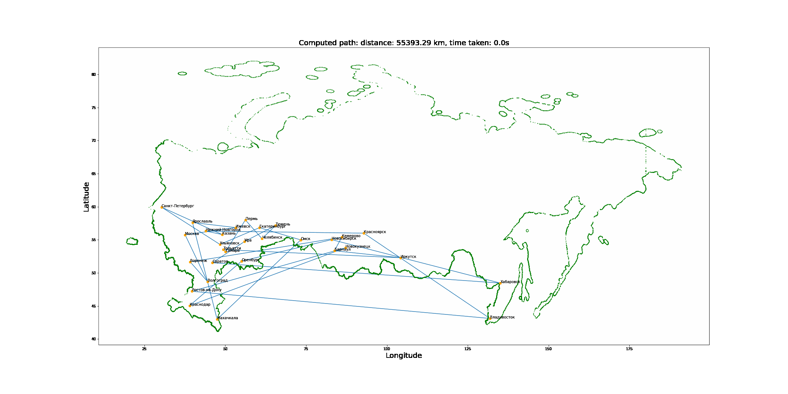

# ST_Course_S23
Repository for assignments for Statistichal Techniques course
----
Innopolis, Russia

Spring 2023

## Results of Assignment 2
### Simulated Annealing with cooling ratio **0.8**

  

### Simulated Annealing with cooling ratio **0.9**

  

### Simulated Annealing with cooling ratio **0.99**

  

